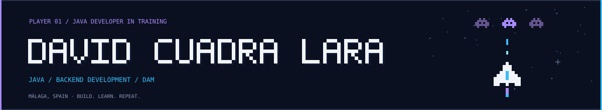

  

  <strong>Java Developer in Training · Multiplatform Application Development</strong> 
  Málaga, Spain · Building towards Java &amp; Spring Boot backend development

  
  

  <a href="#about-me">About me</a> ·
  <a href="#tech-stack">Tech stack</a> ·
  <a href="#projects">Projects</a> ·
  <a href="#github-activity">Activity</a> ·
  <a href="#connect-with-me">Contact</a>

## About me

I'm **David Cuadra Lara**, a second-year **DAM** student focused on Java development. I'm currently learning **Spring Boot** and improving how I organise application logic, persistence and user interfaces.

My background in **3D design** brings a visual perspective to the software I build. I enjoy turning practical ideas into applications, understanding the decisions behind the code and improving projects step by step.

- **Current project:** WorkFinder, a JavaFX application for organising job and internship applications.
- **Learning focus:** Java fundamentals, SQL/JDBC, layered application design and Spring Boot.
- **Looking for:** a software development internship in Málaga or remotely, with a particular interest in Java backend development.

## Tech stack

### Java & desktop development

  
  
  
  

### Data & persistence

  
  
  
  

### Development tools

  
  
  
  
  

### Currently learning

  
  

### Creative background

  
  

## Projects

| Project | What I'm building | Technologies | Status |
| --- | --- | --- | --- |
| **[Inventory Management](https://github.com/DCuadraLara/inventory-management)** | Academic application for entering inventory items, with form validation and visual feedback on invalid fields. | Java · Swing · NetBeans · Ant | Published academic project |
| **WorkFinder** | Personal application for tracking job and internship applications, their status and related notes. | Java · JavaFX · Maven | In development |

<!-- Add a link to WorkFinder once its public repository is available. -->

## GitHub activity

  
  

  

## Contribution arcade

  <picture>
    <source media="(prefers-color-scheme: dark)" srcset="https://raw.githubusercontent.com/DCuadraLara/DCuadraLara/output/github-snake-dark.svg" />
    <source media="(prefers-color-scheme: light)" srcset="https://raw.githubusercontent.com/DCuadraLara/DCuadraLara/output/github-snake.svg" />
    
  </picture>

<!-- SPACE SHOOTER: remove the comment markers below once space-shooter.gif exists. -->
<!--

  
🚀 Play the space shooter animation

  

    
  

-->

## Connect with me

  

<!-- CONTACT: -->

  
  

  Outside of code: 3D design, reading, films, training and creating things.

